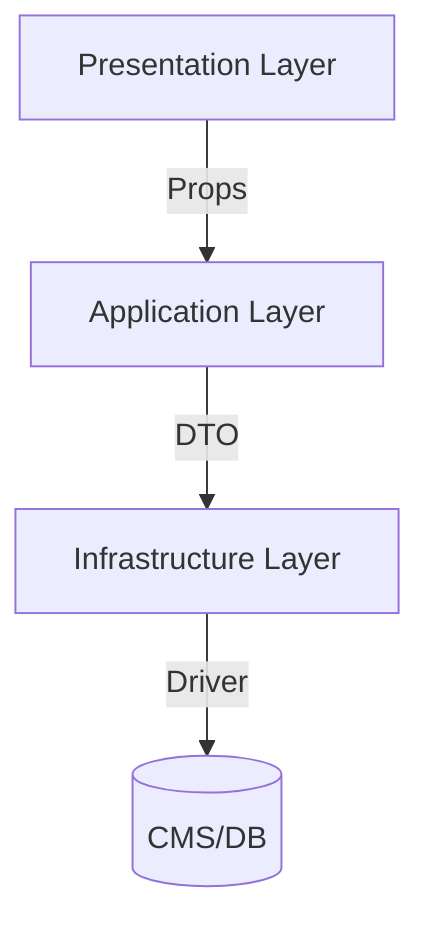
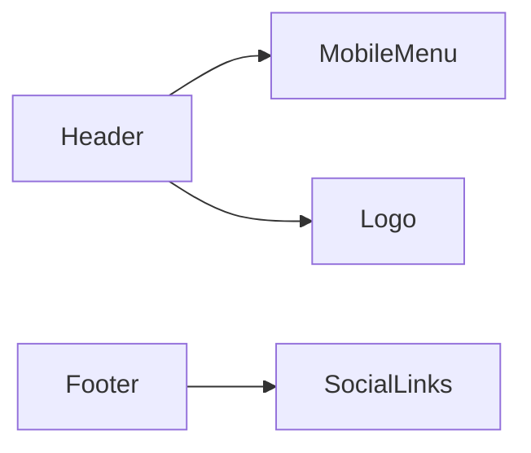
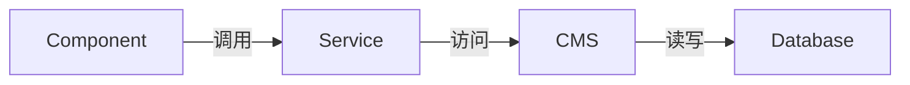
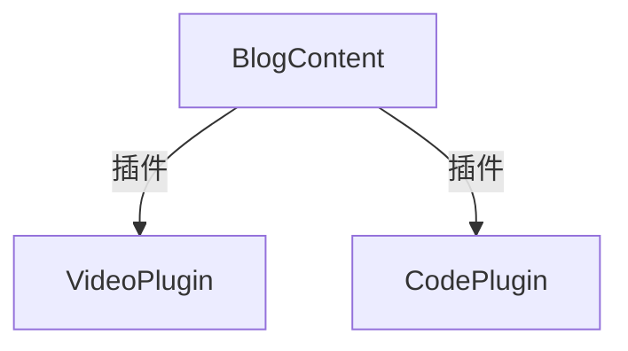

# 全站技术架构规范

## 1. 系统架构


## 2. 核心模块规范

### 2.1 博客系统
#### 组件矩阵
| 组件名          | 类型       | 功能说明                     | 核心Props                  |
|-----------------|------------|----------------------------|---------------------------|
| BlogCard       | 展示组件    | 文章卡片展示                 | post: BlogPostDTO         |
| BlogList       | 容器组件    | 带分页的文章列表              | pageSize?: number         |
| BlogContent    | 布局组件    | 文章详情渲染                 | post: BlogPostDTO         |
| RelatedPosts   | 业务组件    | 相关文章推荐                 | posts: BlogPostDTO[]      |

#### 服务接口
```typescript
interface BlogService {
  getPosts(params: PaginationParams): Promise<BlogPostDTO[]>
  getPost(id: string): Promise<BlogPostDTO | null>
  createPost(postData: CreatePostDTO): Promise<BlogPostDTO>
}
```

### 2.2 导航系统
#### 组件规范


| 组件名          | 技术要求                     | 状态管理                 |
|----------------|----------------------------|------------------------|
| Header        | 响应式/Sticky定位           | 使用useSession          |
| MobileMenu    | 手势支持/焦点陷阱            | 本地isOpen状态          |
| Footer        | 多列布局/动态版权年份         | 无状态                 |

## 3. 数据架构

### 3.1 数据类型定义
```typescript
interface BlogPostDTO {
  id: string               // 三位数格式ID
  title: string            // 最大长度120字符
  content: string          // Markdown格式
  excerpt: string          // 摘要文本
  imageUrl?: string        // 封面图URL
  category: string         // 分类标签
  createdAt: string       // ISO8601格式
}
```

### 3.2 状态管理


## 4. 开发规范

### 4.1 组件开发
1. **Props规范**：
   - 必须定义TypeScript接口
   - 可选参数需带默认值
   - 禁止透传DOM属性

2. **样式要求**：
   ```tsx
   // 正确示例
   <div className="bg-white dark:bg-gray-800">
   // 错误示例
   <div style={{ backgroundColor: '#fff' }}>
   ```

### 4.2 服务层约束
| 方法名        | 错误处理                   | 性能要求          |
|--------------|--------------------------|-----------------|
| getPosts    | 返回空数组而非抛出异常      | <300ms响应       |
| getPost     | 返回null当数据不存在        | <200ms响应       |
| createPost  | 必须验证用户权限            | <500ms完成       |

## 5. 扩展接口

### 5.1 插件接口
```typescript
interface ContentPlugin {
  render(content: string): ReactNode
  validate(content: string): boolean
}
```

### 5.2 扩展点示例


## 附录A：组件目录树
```
components/
├─ modules/
│  ├─ blog/
│  │  ├─ BlogCard.tsx
│  │  ├─ BlogList.tsx
│  │  └─ ...
├─ ui/
│  ├─ Button.tsx
│  ├─ Pagination.tsx
│  └─ ...
└─ navigation/
   ├─ Header.tsx
   ├─ Footer.tsx
   └─ ...
```