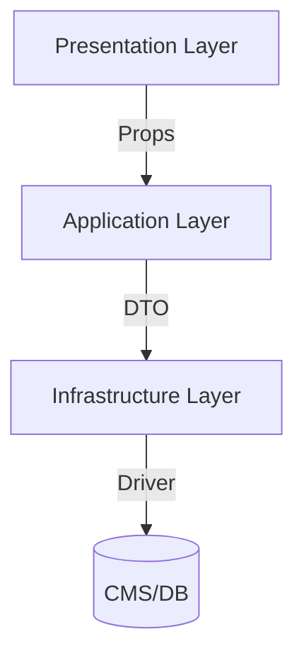

# Unified Technical Architecture Document

## 1. System Overview
This document consolidates the technical architecture of the project, combining insights from previous versions (`site-architecture-v2.md`, `site-architecture-v3.md`) and the development baseline. It aims to provide a comprehensive and unified view of the system's design, implementation, and best practices.

---

## 2. High-Level Architecture
The system follows a layered architecture to ensure modularity, scalability, and maintainability:



### 2.1 Layers
- **Presentation Layer**: Handles UI components and user interactions.
- **Application Layer**: Contains business logic and orchestrates data flow between layers.
- **Infrastructure Layer**: Manages data access, external APIs, and CMS integrations.

---

## 3. File and Directory Structure
The project adheres to a modular directory structure to separate concerns and improve code organization:

```
src/
├── app/                    # Page routing and layouts
│   ├── (main)/
│   │   ├── layout.tsx        # Main layout
│   │   ├── page.tsx          # Homepage
│   │   ├── blog/             # Blog module
│   │   ├── tools/            # Tools module
│   │   └── learning/         # Learning module
│   └── (admin)/             # Admin panel routing
│
├── components/             # Reusable UI components
│   ├── ui/                  # Basic UI components
│   │   ├── cards/
│   │   ├── navigation/
│   │   └── ...
│   └── modules/             # Business-specific components
│       ├── blog/
│       ├── tools/
│       └── learning/
│
├── lib/
│   ├── application/         # Business logic
│   │   ├── blog/
│   │   ├── tools/
│   │   └── learning/
│   └── infrastructure/      # Infrastructure services
│       ├── cms/
│       ├── api/
│       └── services/
│
├── types/                  # Global type definitions
└── utils/                  # Utility functions
```

---

## 4. Core Modules

### 4.1 Blog System
#### Components
| Component Name  | Type       | Description                     | Core Props                  |
|-----------------|------------|---------------------------------|-----------------------------|
| BlogCard        | Display    | Displays a blog card            | `post: BlogPostDTO`         |
| BlogList        | Container  | Paginated list of blog posts    | `pageSize?: number`         |
| BlogContent     | Layout     | Renders blog post details       | `post: BlogPostDTO`         |
| RelatedPosts    | Business   | Recommends related blog posts   | `posts: BlogPostDTO[]`      |

#### Service Interface
```typescript
interface BlogService {
  getPosts(params: PaginationParams): Promise<BlogPostDTO[]>
  getPost(id: string): Promise<BlogPostDTO | null>
  createPost(postData: CreatePostDTO): Promise<BlogPostDTO>
}
```

### 4.2 Navigation System
#### Components
| Component Name  | Technical Requirements         | State Management          |
|-----------------|--------------------------------|---------------------------|
| Header          | Responsive/Sticky positioning | Uses `useSession`         |
| MobileMenu      | Gesture support/Focus traps   | Local `isOpen` state      |
| Footer          | Multi-column layout/Dynamic year | Stateless               |

---

## 5. Data Architecture

### 5.1 Data Types
```typescript
interface BlogPostDTO {
  id: string               // Unique identifier
  title: string            // Blog title
  excerpt: string          // Short description
  content: string          // Full content
  category: string         // Blog category
  date: string             // Publication date
  image: string            // Cover image URL
}
```

### 5.2 Data Flow
- **Frontend**: Fetches data via API endpoints.
- **Backend**: Processes requests and interacts with the CMS/Database.
- **CMS/Database**: Stores and manages content.

---

## 6. Development Standards

### 6.1 Coding Guidelines
- **TypeScript**: Enforce strict typing for all modules.
- **Component Design**: Follow atomic design principles.
- **State Management**: Use React hooks for local state and context for global state.

### 6.2 Testing
- **Unit Tests**: Cover all core business logic.
- **Integration Tests**: Validate API interactions.
- **E2E Tests**: Ensure user flows work as expected.

---

## 7. Recommendations

### 7.1 Scalability
- Modularize components further to support future features.
- Use lazy loading for non-critical components to improve performance.

### 7.2 Security
- Implement server-side validation for all API endpoints.
- Use environment variables for sensitive configurations.

### 7.3 SEO Optimization
- Dynamically generate meta tags for all pages.
- Implement structured data (JSON-LD) for better search engine indexing.

---

## 8. Conclusion
This unified architecture document serves as a single source of truth for the project's technical design. It ensures consistency, scalability, and maintainability across all modules and layers.
